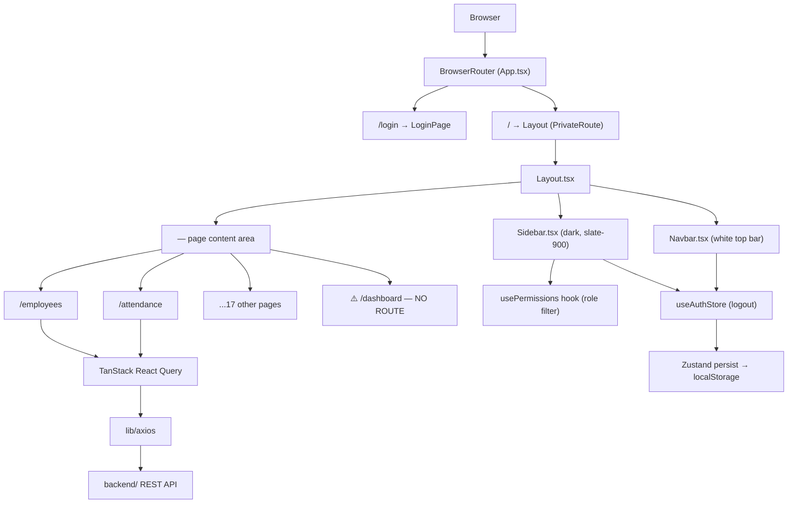

# Code Analysis Report — HRMS Dashboard Enhancement

**Run ID:** `20260814T175951_ya9yzo`
**Repository:** `arpitsaxena-gl/hrms-system-12`
**Branch analysed:** `main`
**Analysis scope:** Full `client/` frontend SPA — all files relevant to layout, routing, state, and the dashboard enhancement request.

---

## 1. Detected Stack

| Layer | Technology | Version | Confidence | Evidence |
|-------|-----------|---------|------------|---------|
| Language | TypeScript | ~6.0.2 | High | `client/tsconfig.app.json`, `client/package.json` devDeps |
| Language (JSX) | TSX | — | High | All `src/` files use `.tsx` extension |
| Frontend Framework | React | 19.2.7 | High | `package.json` dependencies |
| Build Tool | Vite | 8.1.1 | High | `vite.config.ts`, `package.json` scripts |
| Routing | React Router DOM | 7.18.1 | High | `App.tsx` imports + `package.json` |
| State Management | Zustand | 5.0.14 | High | `store/authStore.ts`, `persist` middleware |
| Server State / Data Fetching | TanStack React Query | 5.101.4 | High | `AttendancePage.tsx` `useQuery`/`useMutation` |
| HTTP Client | Axios | 1.18.1 | High | `lib/axios` referenced in pages and store |
| Styling | Tailwind CSS | 3.4.19 | High | `tailwind.config.js`, `index.css` `@tailwind` directives |
| Icon Library | Lucide React | 1.26.0 | High | `Sidebar.tsx` imports 20+ named icons |
| Charts | Recharts | 3.10.0 | High | `package.json` dependency |
| Date Utilities | date-fns | 4.4.0 | High | `AttendancePage.tsx` `format()` usage |
| Form Handling | React Hook Form + Zod | 7.82 / 4.4.3 | High | `package.json` deps |
| Testing | Vitest + Testing Library | 3.2.4 / 16.3 | High | `package.json` devDeps, `src/test/` dir |
| Linter | oxlint | 1.71.0 | High | `.oxlintrc.json`, `package.json` lint script |
| Real-time | Socket.IO Client | 4.8.3 | Medium | `package.json` dep (no usage seen in analysed files) |

### Per-File Roles

| File | Role |
|------|------|
| `client/src/App.tsx` | Entry point / route registry |
| `client/src/main.tsx` | React root mount + providers |
| `client/src/components/layout/Layout.tsx` | Shell layout — sidebar + navbar + outlet |
| `client/src/components/layout/Sidebar.tsx` | Left navigation component |
| `client/src/components/layout/Navbar.tsx` | Top header bar component |
| `client/src/components/ui/StatCard.tsx` | Reusable stat card UI primitive |
| `client/src/components/ui/Table.tsx` | Reusable data table primitive |
| `client/src/components/ui/Badge.tsx` | Status badge primitive |
| `client/src/components/ui/Avatar.tsx` | User avatar primitive |
| `client/src/store/authStore.ts` | Auth global state (Zustand, persisted) |
| `client/src/types/index.ts` | Shared TypeScript interfaces |
| `client/src/pages/attendance/AttendancePage.tsx` | Attendance feature page (reference pattern) |
| `client/tailwind.config.js` | Tailwind theme config |
| `client/src/index.css` | Global CSS utilities and component classes |

---

## 2. Architectural Context

### Layering & Separation of Concerns

The project follows a clean **feature-page / shell** architecture:

- **Shell layer:** `Layout.tsx` orchestrates the persistent chrome (sidebar + navbar) and renders pages through `<Outlet>`.
- **Page layer:** `pages/<feature>/<Feature>Page.tsx` — each page owns its data fetching (TanStack Query), local UI state (useState), and rendering.
- **UI primitive layer:** `components/ui/` — stateless/near-stateless display components (`StatCard`, `Table`, `Badge`, `Avatar`, `Modal`).
- **State layer:** `store/authStore.ts` — single Zustand store for auth session, token management, and user hydration.
- **Type layer:** `types/index.ts` — centralized TypeScript interfaces for all API entities.
- **Config layer:** `tailwind.config.js` + `index.css` — design tokens and component utility classes.

Separation is well-maintained: no business logic leaks into layout components, and pages don't directly mutate global state (they call `useAuthStore` actions or TanStack Query mutations).

### Architecture Style

**Single Page Application (SPA), feature-sliced pages, layered MVC-variant.** Not microservices; the frontend is a monolithic SPA that consumes a separate Node.js REST API backend (`backend/`).

### Component / Flow Diagram

---

## 3. Data & State Structures

### Global State — `authStore`

| Field | Type | Scope | Description |
|-------|------|-------|-------------|
| `user` | `User \| null` | Global (persisted) | Logged-in user entity |
| `token` | `string \| null` | Global (persisted) | JWT access token |
| `refreshToken` | `string \| null` | Global (persisted) | JWT refresh token |
| `isAuthenticated` | `boolean` | Global (persisted) | Auth flag |
| `isLoading` | `boolean` | Global (transient) | Login in-progress indicator |

**Actions:** `login(email, password)`, `logout()`, `updateUser(partial)`, `fetchMe()`

### Tailwind Design Tokens (from `tailwind.config.js`)

| Token | Value | Usage |
|-------|-------|-------|
| `primary.*` | Blue scale `#3b82f6` → `#1e3a8a` | CTA buttons, active nav, icon badges |
| `sidebar.DEFAULT` | `#1e293b` (slate-800ish) | Sidebar background |
| `sidebar.hover` | `#334155` | Sidebar item hover |
| `font.sans` | Inter, system-ui | Base typography |

### CSS Utility Classes (from `index.css` `@layer components`)

| Class | Description |
|-------|-------------|
| `.card` | `bg-white rounded-xl shadow-sm border border-gray-100 p-6` |
| `.page-title` | `text-2xl font-bold text-gray-900` |
| `.page-subtitle` | `text-sm text-gray-500 mt-1` |
| `.btn-primary` | Blue filled button |
| `.btn-secondary` | Gray button |
| `.animate-fade-in` | `fadeIn` keyframe (translateY -8px → 0, opacity 0 → 1, 0.2s) |
| `.skeleton` | Shimmer loading placeholder |
| `.empty-state` | Centered empty content area |

### `StatCard` Component Props Interface

| Prop | Type | Default | Required |
|------|------|---------|----------|
| `title` | `string` | — | Yes |
| `value` | `string \| number` | — | Yes |
| `icon` | `LucideIcon` | — | Yes |
| `iconBg` | `string` (Tailwind class) | `bg-primary-50` | No |
| `iconColor` | `string` (Tailwind class) | `text-primary-600` | No |
| `trend` | `number` | — | No |
| `trendLabel` | `string` | — | No |
| `loading` | `boolean` | — | No |
| `suffix` | `string` | — | No |

The icon is rendered in a `p-3 rounded-xl` square container — matching the "pastel square icon badge" specification exactly.

---

## 4. Inputs, Parameters & Contracts

### Inputs & Fields Report

#### Unit: `Sidebar` Component (`client/src/components/layout/Sidebar.tsx`)

| # | Name | Direction/Role | Data Type | Nature | Default | Notes |
|---|------|----------------|-----------|--------|---------|-------|
| 1 | `collapsed` | INPUT (prop) | `boolean` | Mandatory | — | Controls expanded/icon-only state |
| 2 | `onClose` | INPUT (prop) | `() => void` | Optional | `undefined` | Mobile close button callback |

**`NAV_ITEMS` array** — static navigation config:

| # | Label | Icon | Route | Roles filter |
|---|-------|------|-------|-------------|
| — | (Dashboard missing) | — | — | — |
| 1 | Employees | Users | `/employees` | all |
| 2 | Departments | Building2 | `/departments` | admin, hr |
| 3 | Designations | Briefcase | `/designations` | admin, hr |
| 4 | Attendance | Clock | `/attendance` | all |
| 5 | Leaves | CalendarDays | `/leaves` | all |
| 6 | Payroll | DollarSign | `/payroll` | all |
| 7 | Recruitment | UserPlus | `/recruitment` | admin, hr |
| 8 | Performance | Star | `/performance` | all |
| 9 | Training | GraduationCap | `/training` | all |
| 10 | Documents | FileText | `/documents` | all |
| 11 | Holidays | Gift | `/holidays` | all |
| 12 | Shifts | Timer | `/shifts` | admin, hr |
| 13 | Reports | BarChart3 | `/reports` | admin, hr |
| 14 | Users | UserCircle | `/users` | admin, hr |
| 15 | Notifications | Bell | `/notifications` | all |
| 16 | Settings | Settings | `/settings` | admin |
| 17 | Audit Logs | Shield | `/audit` | admin |

#### Unit: `App.tsx` Route Registry

| Route | Element | Guard |
|-------|---------|-------|
| `/login` | `LoginPage` | PublicRoute (redirect to /dashboard if authed) |
| `/` (layout shell) | `Layout` | PrivateRoute (redirect to /login if unauthed) |
| `employees` | `EmployeesPage` | — |
| `attendance` | `AttendancePage` | — |
| _(17 more routes)_ | _(various pages)_ | — |
| `*` (catch-all) | 404 page | — |
| **`dashboard`** | **MISSING** | — |

#### Unit: `StatCard` (`client/src/components/ui/StatCard.tsx`)

| # | Prop | Direction | Type | Nature |
|---|------|-----------|------|--------|
| 1 | title | INPUT | string | Mandatory |
| 2 | value | INPUT | string \| number | Mandatory |
| 3 | icon | INPUT | LucideIcon | Mandatory |
| 4 | iconBg | INPUT | string (TW class) | Optional |
| 5 | iconColor | INPUT | string (TW class) | Optional |
| 6 | trend | INPUT | number | Optional |
| 7 | trendLabel | INPUT | string | Optional |
| 8 | loading | INPUT | boolean | Optional |
| 9 | suffix | INPUT | string | Optional |

---

## 5. Qualitative Validation Logic

### Validations for `token` / `isAuthenticated` (authStore)

- **Category:** Authorization / Access Control
  - **Location:** `App.tsx`, `PrivateRoute` component
  - **Code:** `if (!isAuthenticated || !token) return <Navigate to="/login" replace />`
  - **Triggered:** On every render of a protected route
  - **Effect:** Hard redirect to `/login`

- **Category:** Authorization / Access Control (inverse)
  - **Location:** `App.tsx`, `PublicRoute` component
  - **Code:** `if (isAuthenticated) return <Navigate to="/dashboard" replace />`
  - **Triggered:** When authenticated user visits `/login`
  - **Effect:** Redirect to `/dashboard` — ⚠️ but `/dashboard` route does not exist, landing on 404 fallback

### Validations for `collapsed` prop (Sidebar)

- **Category:** Conditional rendering
  - **Location:** `Sidebar.tsx`, multiple conditional blocks
  - **Code:** `{!collapsed && {item.label}}` | `{collapsed && 
...icon...
}`
  - **Triggered:** Every render cycle
  - **Effect:** Text labels hidden (icon-only mode) when `collapsed === true`

### Conditional Dependencies

| Field | Required When | Condition |
|-------|---------------|-----------|
| `onClose` handler | Conditional | Mobile sidebar — `onClose` truthy renders `<button>` X |
| Nav item `roles` filter | Conditional | Item only shown if `!item.roles \|\| item.roles.includes(role)` |
| `trend` TrendingUp/Down icon | Conditional | Rendered only when `trend !== undefined` |
| `trendLabel` text | Conditional | Rendered only when `trendLabel !== undefined` |

---

## 6. Performance & Stability

| Finding | Severity | Detail |
|---------|----------|--------|
| Recharts v3 lazy-loading | Low | Recharts is a large bundle. Dashboard will pull it in on first load. Consider `React.lazy()` for `DashboardPage` if bundle size is a concern. |
| Zustand persist re-hydration | Low | Auth store persists `user` object fully; if the user object grows large (e.g. with many `documents[]`), localStorage entry grows. Current types show bounded fields. |
| `fetchMe` on every mount | Info | `App.tsx` calls `fetchMe()` inside `useEffect([isAuthenticated])`. This fires once on app load; acceptable but adds a network round-trip before the first render cycle completes. |
| Recharts ResponsiveContainer | Info | Using `<ResponsiveContainer width="100%">` requires a parent with a defined pixel height — must set explicit height on the chart container div in DashboardPage. |

---

## 7. Security

| Finding | Severity | Category | Detail |
|---------|----------|----------|--------|
| JWT stored in localStorage | Medium | Sensitive data exposure | `authStore.ts:31-32` stores `token` and `refreshToken` in `localStorage`. Susceptible to XSS token theft. Acceptable for internal tools; flag for client review if external-facing. |
| No CSRF protection observed | Low | Access control | REST API with Bearer token is generally CSRF-safe, but depends on backend CORS config (not analysed). |
| `readOnly` search input | Info | Input handling | `Navbar.tsx` search `<input>` is `readOnly` — prevents injection via that field; this appears intentional (placeholder UI). |

---

## 8. Integration & Connectivity

| Integration | Type | Direction | Notes |
|-------------|------|-----------|-------|
| `backend/` REST API | HTTP (Axios) | Bidirectional | Abstracted via `lib/axios`. All pages use `/attendance`, `/auth/login`, `/auth/me`, etc. |
| Socket.IO server | WebSocket | Bidirectional | Client library installed; usage not observed in analysed files — likely used in notification pages. |
| TanStack React Query | In-process cache | Bidirectional | Wraps Axios calls; `queryKey` arrays used for cache invalidation. |
| Zustand + localStorage | In-process / persisted | Bidirectional | Auth session persisted across page refreshes. |

### Dashboard-relevant API endpoints (inferred from existing pages)

| Endpoint | Purpose |
|----------|---------|
| `GET /employees` | Total employee count (stat card) |
| `GET /attendance/summary` | Present/absent/on-leave daily figures |
| `GET /leaves?status=pending` | Pending leave count |
| `GET /payroll` | Monthly payroll figure |
| `GET /recruitment?status=open` | Open positions count |

---

## 9. Readability, Maintainability & Code Smells

| Issue | Severity | Location | Detail |
|-------|----------|----------|--------|
| Dashboard route missing but referenced | Critical | `App.tsx` | `PublicRoute` redirects to `/dashboard`; 404 fallback links to `/dashboard`; no route defined. |
| Dashboard nav item absent | High | `Sidebar.tsx` | `NAV_ITEMS` has 17 items, no Dashboard entry. First item is Employees. |
| Hard-coded "SA" / "Super Admin" in layout | Low | `Sidebar.tsx:84,88`, `Navbar.tsx:32` | User display name and initials are static strings. Should read from `useAuthStore().user` for correctness. |
| `useEffect` dependency lint warning | Low | `App.tsx:45` | `[isAuthenticated]` array missing `fetchMe` — would trigger ESLint `react-hooks/exhaustive-deps` (suppressed by oxlint config). |
| No index route inside Layout | Medium | `App.tsx` | `/` with no index child means navigating to `/` directly shows nothing (relies on redirect from Login). Should add `<Route index element={<Navigate to="dashboard" replace />} />`. |
| Static `readOnly` search | Low | `Navbar.tsx` | Search input is decorative; if search feature is planned, this is a placeholder debt. |

---

## 10. Quantitative Field Metrics & Gap Analysis

### Field Totals Matrix

| Scope | Total Fields | Mandatory | Optional | With Defaults |
|-------|-------------|-----------|----------|---------------|
| `Sidebar` props | 2 | 1 | 1 | 0 |
| `StatCard` props | 9 | 3 | 6 | 2 (`iconBg`, `iconColor`) |
| `authStore` state fields | 5 | — | — | — |
| Route params (App.tsx) | 0 direct | — | — | — |

### Validation Category Counts

| Category | Count | Locations |
|----------|-------|-----------|
| Input / presence | 2 | `PrivateRoute`, `PublicRoute` |
| Business / auth | 1 | `PrivateRoute` token check |
| Database | 0 | (no DB layer in client) |
| Conditional rendering | 4 | `Sidebar` collapsed, `StatCard` trend/label, nav `roles` filter |

### Validation Gap Analysis

| Gap | Severity | Description |
|-----|----------|-------------|
| `/dashboard` route exists in `PublicRoute` redirect but has no handler | Critical | Auth'd users land on 404 fallback instead of the Dashboard page. |
| Dashboard absent from `NAV_ITEMS` | High | No sidebar navigation link to Dashboard even after route is created. |
| No index redirect inside Layout | Medium | Direct navigation to `/` when authenticated shows blank Outlet. |
| User display name hard-coded | Low | "Super Admin" / "SA" in Sidebar footer and Navbar are static; should read from `authStore.user`. |

---

## 11. Prioritized Findings

| # | Finding | Severity | Impact | Effort | Section |
|---|---------|----------|--------|--------|---------|
| 1 | `DashboardPage.tsx` does not exist — no `/dashboard` route defined | Critical | Auth flow broken; redirects hit 404 | Low (create one file) | §9, §4 |
| 2 | `dashboard` entry missing from `Sidebar.tsx` `NAV_ITEMS` | High | No nav link even after page exists | Low (one array entry) | §4 |
| 3 | No `<Route index>` redirect in Layout shell | Medium | Direct `/` navigation shows blank | Low (one line) | §8, §9 |
| 4 | JWT stored in localStorage | Medium | XSS token theft risk | Medium (httpOnly cookie migration) | §7 |
| 5 | Hard-coded "SA" / "Super Admin" in layout components | Low | Shows wrong user if non-admin logs in | Low (read from authStore.user) | §8 |
| 6 | Recharts bundle not code-split | Low | Dashboard load adds chart weight to initial bundle | Low (React.lazy on DashboardPage) | §6 |
| 7 | `fetchMe` dependency array lint gap | Low | Theoretical stale closure | Trivial (add to deps array) | §8 |

---

## 12. Summary for Agentic Memory

The HRMS client is a React 19 + TypeScript SPA (Vite 8, React Router DOM v7, TanStack Query v5, Zustand v5, Tailwind CSS v3, Recharts v3, Lucide React v1, date-fns v4) structured as a feature-page SPA with a persistent shell layout (dark slate-900 sidebar + white navbar). The critical dashboard gap has three dimensions: (1) `DashboardPage.tsx` does not exist in `client/src/pages/`, (2) no `/dashboard` child route is registered in `App.tsx`'s private Layout route, and (3) `NAV_ITEMS` in `Sidebar.tsx` lacks a Dashboard entry as its first item — meaning authenticated users are silently 404'd on login redirect. The existing `StatCard` UI primitive (9 props: title, value, icon, iconBg, iconColor, trend, trendLabel, loading, suffix) already matches the design spec's "elevated white card with pastel square icon badge" requirement exactly and should be reused. Both Recharts and date-fns are already installed, so the chart section and date-based greeting can be implemented without adding dependencies. The correct fix requires creating one new file (`DashboardPage.tsx`) and applying surgical edits to two existing files (`App.tsx` route registry, `Sidebar.tsx` NAV_ITEMS).
