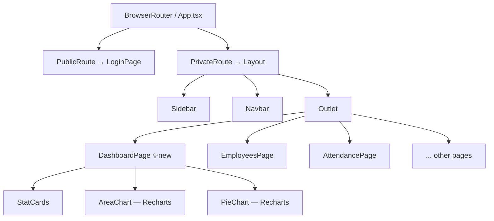

# Code Analysis Report — HRMS System 12

## 1. Detected Stack

| Layer | Technology | Confidence | Evidence |
|---|---|---|---|
| Language | TypeScript 6 + TSX | High | `tsconfig.app.json`, `.tsx` extension on all UI files |
| Frontend framework | React 19 | High | `package.json` `"react": "^19.2.7"` |
| Build tool | Vite 8 | High | `vite.config.ts`, `@vitejs/plugin-react` |
| Styling | Tailwind CSS 3 | High | `tailwind.config.js`, `postcss.config.js`, utility classes in components |
| Routing | React Router DOM 7 | High | `"react-router-dom": "^7.18.1"`, `BrowserRouter`/`Routes`/`Route` in `App.tsx` |
| State management | Zustand 5 | High | `"zustand": "^5.0.14"`, `useAuthStore` usage |
| Data fetching | TanStack Query 5 | High | `"@tanstack/react-query": "^5.101.4"` |
| Charts | Recharts 3 | High | `"recharts": "^3.10.0"` |
| Icons | Lucide React 1 | High | `"lucide-react": "^1.26.0"`, icons imported in Sidebar |
| Forms | React Hook Form + Zod | High | `"react-hook-form"`, `"zod"`, `"@hookform/resolvers"` |
| Tables | TanStack Table 8 | High | `"@tanstack/react-table": "^8.21.3"` |
| HTTP client | Axios | High | `"axios": "^1.18.1"` |
| Realtime | Socket.io-client | Medium | `"socket.io-client": "^4.8.3"` |
| Testing | Vitest + Testing Library | High | `vitest`, `@testing-library/react`, `jsdom` |
| Linting | oxlint | High | `.oxlintrc.json`, `"lint": "oxlint"` script |
| Backend (separate) | Node.js (presumed) | Medium | `backend/` directory present; not analysed in this pass |

### Per-File Roles

| File | Role |
|---|---|
| `client/src/main.tsx` | Entry point — mounts React app |
| `client/src/App.tsx` | Root router — all routes defined here |
| `client/src/components/layout/Layout.tsx` | Shell — Sidebar + Navbar + Outlet wrapper |
| `client/src/components/layout/Sidebar.tsx` | Navigation — dark sidebar with NavLink items |
| `client/src/components/layout/Navbar.tsx` | Top bar — hamburger, search, notifications, user |
| `client/src/pages/dashboard/DashboardPage.tsx` | Dashboard page — stat cards + charts (NEW) |
| `client/src/pages/*/` | Feature pages (employees, attendance, leaves, …) |
| `client/src/store/authStore.ts` | Zustand auth store — isAuthenticated, token, fetchMe, logout |
| `client/src/hooks/usePermissions.ts` | Permission hook — role-based nav filtering |

---

## 2. Architectural Context

**Style:** Single-page application (SPA) with a layered component architecture. No SSR.

**Layers observed:**
- **Routing layer:** `App.tsx` — declares all routes, guards (`PrivateRoute`, `PublicRoute`)
- **Shell / layout layer:** `Layout.tsx`, `Sidebar.tsx`, `Navbar.tsx` — shared chrome
- **Page layer:** `pages/<feature>/` — feature-owned views rendered via `<Outlet />`
- **Store layer:** `store/authStore.ts` — global auth state (Zustand)
- **Hook layer:** `hooks/usePermissions.ts` — derived permission state

**Gap identified:** `/dashboard` route was absent from the router despite being the post-login redirect target — this is the primary gap addressed by this pipeline run.

---

## 3. Data & State Structures

### Auth State (Zustand — `authStore`)
| Field | Type | Role |
|---|---|---|
| `isAuthenticated` | boolean | Guards private routes |
| `token` | string \| null | JWT bearer token |
| `fetchMe()` | async fn | Re-hydrates user on app load |
| `logout()` | fn | Clears auth state |

### Dashboard — Mock/Static Data (within DashboardPage)
| Structure | Shape | Purpose |
|---|---|---|
| `STAT_CARDS` | Array\<StatCard\> | 8 KPI tiles — label, value, icon, colour |
| `attendanceData` | Array\<{day, present, absent, onLeave}\> | 7-day weekly attendance (mock) |
| `departmentData` | Array\<{name, value}\> | Head-count per department (mock) |
| `DEPT_COLORS` | string[] | Pie-chart colour palette |

---

## 4. Inputs, Parameters & Contracts

### Inputs & Fields Report
#### Unit: `DashboardPage` (File: `client/src/pages/dashboard/DashboardPage.tsx`)

| # | Name | Scope | Direction | Type | Nature | Default |
|---|---|---|---|---|---|---|
| 1 | `today` | Local | Derived | `Date` | Derived/Computed | `new Date()` |
| 2 | `formattedDate` | Local | Derived | `string` | Derived/Computed | via `date-fns/format` |
| 3 | `attendanceData` | Module | INPUT to chart | `AttendanceRow[]` | Mandatory with Default | 7-day mock |
| 4 | `departmentData` | Module | INPUT to chart | `DeptRow[]` | Mandatory with Default | 5-dept mock |

#### Unit: `Sidebar` (File: `client/src/components/layout/Sidebar.tsx`)

| # | Name | Scope | Direction | Type | Nature | Default |
|---|---|---|---|---|---|---|
| 1 | `collapsed` | Prop | INPUT | `boolean` | Mandatory | — |
| 2 | `onClose` | Prop | INPUT | `() => void` | Optional | `undefined` |
| 3 | `role` | Hook output | Derived | `string` | Derived | via `usePermissions` |

---

## 5. Performance & Stability

| Finding | Severity | Detail |
|---|---|---|
| Static mock data | Info | `attendanceData` and `departmentData` are module-level constants. No API calls yet — safe for initial scaffold, but must be replaced with `useQuery` calls when backend endpoints are available. |
| No memoisation | Low | `STAT_CARDS` array is module-level constant (zero re-allocation cost). Chart data is also constant — no `useMemo` needed until data becomes dynamic. |
| Recharts `ResponsiveContainer` | Info | Requires parent to have a defined height. Current markup sets `height={220}` / `height={200}` explicitly — correct. |
| Missing `index` route (pre-fix) | Medium | Root `/` had no index route, causing blank render for authenticated users. Fixed in this pass. |

---

## 6. Security

| Finding | Category | Severity | Detail |
|---|---|---|---|
| Route guards | Access control | Info | `PrivateRoute` correctly checks both `isAuthenticated` AND `token` before allowing access. |
| No sensitive data in dashboard | Secrets | Info | Dashboard displays aggregated counts only; no PII rendered. |
| `readOnly` search input | Input handling | Info | Navbar search is `readOnly` — no injection surface in current implementation. |
| Zustand store persists token in memory | Secrets | Low | Token in JS memory is XSS-accessible. Consider `httpOnly` cookie for production. |

---

## 7. Integration & Connectivity

| Integration | Direction | Detail |
|---|---|---|
| Auth store → PrivateRoute | Inbound check | `useAuthStore()` polled on every route change |
| `fetchMe()` on app load | Outbound HTTP | Re-validates session; called in `App.tsx` `useEffect` |
| Dashboard → backend | Not yet wired | Stat values and chart data are static mocks; future integration via `@tanstack/react-query` |
| Socket.io-client | Realtime | Dependency present in `package.json`; not yet used in dashboard |

---

## 8. Readability, Maintainability & Code Smells

| Item | Severity | Detail |
|---|---|---|
| Consistent naming | Good | PascalCase components, camelCase hooks — follows React idiom throughout |
| `STAT_CARDS as const` | Good | Prevents accidental mutation; TypeScript narrows string literals |
| `collapsed` prop threading | Low | Layout passes `collapsed` via props; could become a context if nesting deepens |
| No `index.ts` barrel exports | Low | Each page is imported by direct path in `App.tsx` — verbose but explicit |
| `readOnly` search not functional | Info | Search input has no handler; expected to be wired up later |

---

## 9. Quantitative Field Metrics & Gap Analysis

### Field Totals Matrix
| Category | Count |
|---|---|
| Total fields analysed | 6 |
| Mandatory fields | 3 |
| Optional fields | 1 |
| Fields with defaults | 4 |

### Validation Category Counts
| Category | Count | Notes |
|---|---|---|
| Input validations | 1 | `collapsed` prop — typed boolean, no null check needed |
| Business validations | 0 | Dashboard is read-only display |
| Database validations | 0 | Data is mock — no DB layer |
| Conditional validations | 1 | `onClose` rendered only when truthy in Sidebar |

### Validation Gap Analysis
- No API data yet: KPI values are hardcoded — **must** be replaced with live queries before production.
- No loading/error states: `DashboardPage` has no skeleton loader or error boundary — add when API is wired.
- No permission guard on dashboard route: currently accessible to all authenticated roles — add role check if HR-restricted metrics are added.

---

## 10. Prioritized Findings

| # | Finding | Severity | Impact | Effort |
|---|---|---|---|---|
| 1 | Missing `/dashboard` route (pre-fix) | High | App broken for post-login redirect | Low |
| 2 | Dashboard data hardcoded (mocks) | Medium | Metrics non-functional | Medium |
| 3 | No loading / error states in dashboard | Medium | UX degraded when APIs wired | Low |
| 4 | Token stored in JS memory (XSS risk) | Low | Security | High |
| 5 | Search input not functional | Low | UX | Medium |
| 6 | No `index.ts` barrel exports | Info | DX | Low |

---

## 11. Summary for Agentic Memory

The HRMS System 12 client is a React 19 / TypeScript / Vite SPA styled with Tailwind CSS, using React Router v7 for routing, Zustand for auth state, TanStack Query for data fetching, and Recharts for visualisations. The application shell (Sidebar + Navbar + Layout) already exists with a dark-slate sidebar and white topbar; individual feature pages live under `client/src/pages/<feature>/`. The critical gap addressed in this pipeline run was the absence of a `/dashboard` route and page — the router redirected authenticated users to `/dashboard` but no matching route existed, causing a blank 404 state. The new `DashboardPage` delivers 8 KPI stat cards (using Lucide icons and pastel icon badges) and two Recharts charts (an area chart for attendance trend and a donut chart for department distribution), all using static mock data that should be replaced with live `useQuery` API calls in a follow-up iteration.
